# Análisis de grafo de dependencias — ETL IVR Pipeline v2.0

**Fecha:** 2026-05-06
**Nodos:** 47 | **Aristas:** 74 | **Niveles:** 7

---

## Diagrama completo

```mermaid
flowchart LR

    subgraph C0["Capa 0 — Tablas fuente (cliente, read-only)"]
        t1_25[(tbl_historico\nt1_2025)]
        t2_25[(tbl_historico\nt2_2025)]
        t3_25[(tbl_historico\nt3_2025)]
        t4_25[(tbl_historico\nt4_2025)]
        t1_26[(tbl_historico\nt1_2026)]
        t2_26[(tbl_historico\nt2_2026)]
    end

    subgraph C1["Capa 1 — Funciones de utilidad"]
        subgraph C1a["Base — sin dependencias propias"]
            f_did(["fn_did_segmento"])
            f_nmu(["fn_normalizar_menu"])
            f_nce(["fn_normalizar_centro"])
            f_dur(["fn_duracion_seg"])
            f_dh(["ivr_es_dia_semana"])
        end
        subgraph C1b["Compuestas — dependen de ivr_es_dia_semana"]
            f_cnt(["ivr_contar_dias_semana"])
            f_agr(["ivr_agregar_dias_semana"])
        end
    end

    subgraph C2["Capa 2 — Tablas IACT"]
        subgraph C2a["Control"]
            job_l[(job_execution_log)]
            etl_r[(etl_runs)]
            job_c[(job_config)]
        end
        subgraph C2b["Base analítica — destino del ETL"]
            b_det[(base_ivr_detalle)]
            b_cli[(base_ivr_clientes)]
        end
    end

    subgraph C3["Capa 3 — SPs ETL"]
        etl_d[sp_etl_base_detalle]
        etl_c[sp_etl_base_clientes]
        etl_v[sp_etl_validar]
        etl_m[sp_etl_maestro]
        etl_h[sp_etl_historico]
    end

    subgraph C4["Capa 4 — SPs Reporte"]
        r_cli[sp_rpt_clientes]
        r_cen[sp_rpt_centros_transferencia]
        r_aba[sp_rpt_llamadas_abandonadas]
        r_men[sp_rpt_menu_redirigidos]
        r_mce[sp_rpt_menu_centro]
        r_err[sp_rpt_cMENU_ERROR]
        r_seg[sp_rpt_centros_xsegmento]
    end

    subgraph C5["Capa 5 — Django"]
        subgraph C5a["Servicios y configuración"]
            Router[IVRRouter]
            call_sp[_call_sp]
            svc_r[ivr_reports.py]
            svc_p[ivr_pipeline.py]
        end
        subgraph C5b["Management commands"]
            cmd_e[run_etl cmd]
            hb[heartbeat_thread]
        end
        subgraph C5c["Vistas DRF"]
            V_cli[ClientesView]
            V_cen[CentrosView]
            V_aba[AbandonadasView]
            V_men[MenuRedirigidosView]
            V_mce[MenuCentroView]
            V_err[CMENUErrorView]
            V_seg[CentrosXSegmentoView]
            V_est[ETLEstadoView]
            V_ret[ETLReintentarView]
        end
    end

    subgraph C6["Capa 6 — Schedulers"]
        APSch{{APScheduler}}
        Event{{evt_etl_diario}}
    end

    %% ---------------------------------------------------------------
    %% ARISTAS — Capa 1: funciones compuestas → función base
    %% ---------------------------------------------------------------
    f_cnt -. fn_uses_fn .-> f_dh
    f_agr -. fn_uses_fn .-> f_dh

    %% ---------------------------------------------------------------
    %% ARISTAS — Capa 3: sp_etl_base_detalle
    %% ---------------------------------------------------------------
    etl_d -. uses_fn .-> f_did
    etl_d -. uses_fn .-> f_nmu
    etl_d -. uses_fn .-> f_nce
    etl_d -. uses_fn .-> f_dh
    etl_d -. reads .-> t1_25
    etl_d -. reads .-> t2_25
    etl_d -. reads .-> t3_25
    etl_d -. reads .-> t4_25
    etl_d -. reads .-> t1_26
    etl_d -. reads .-> t2_26
    etl_d -->|writes| b_det
    etl_d -->|writes| job_l

    %% ---------------------------------------------------------------
    %% ARISTAS — Capa 3: sp_etl_base_clientes
    %% ---------------------------------------------------------------
    etl_c -. uses_fn .-> f_did
    etl_c -. reads .-> t1_25
    etl_c -. reads .-> t2_25
    etl_c -. reads .-> t3_25
    etl_c -. reads .-> t4_25
    etl_c -. reads .-> t1_26
    etl_c -. reads .-> t2_26
    etl_c -->|writes| b_cli
    etl_c -->|writes| job_l

    %% ---------------------------------------------------------------
    %% ARISTAS — Capa 3: sp_etl_validar
    %% ---------------------------------------------------------------
    etl_v -. reads .-> b_det
    etl_v -. reads .-> b_cli

    %% ---------------------------------------------------------------
    %% ARISTAS — Capa 3: sp_etl_maestro
    %% ---------------------------------------------------------------
    etl_m ==>|calls| etl_d
    etl_m ==>|calls| etl_c
    etl_m ==>|calls| etl_v
    etl_m -->|writes| job_l
    etl_m -->|writes| etl_r
    etl_m -. reads .-> job_c

    %% ---------------------------------------------------------------
    %% ARISTAS — Capa 3: sp_etl_historico
    %% ---------------------------------------------------------------
    etl_h ==>|calls| etl_d
    etl_h ==>|calls| etl_c
    etl_h ==>|calls| etl_v
    etl_h -->|writes| job_l

    %% ---------------------------------------------------------------
    %% ARISTAS — Capa 4: SPs de reporte
    %% ---------------------------------------------------------------
    r_cli -. reads .-> b_cli
    r_cen -. reads .-> b_det
    r_aba -. reads .-> b_det
    r_men -. reads .-> b_det
    r_mce -. reads .-> b_det
    r_err -. reads .-> b_det
    r_seg -. reads .-> b_det
    r_seg -. uses_fn .-> f_dh
    r_seg -. uses_fn .-> f_cnt
    r_seg -. uses_fn .-> f_agr
    r_seg -. uses_fn .-> f_dur

    %% ---------------------------------------------------------------
    %% ARISTAS — Capa 5: Django
    %% ---------------------------------------------------------------
    call_sp -. cfg .-> Router
    svc_r -. uses .-> call_sp
    svc_r ==>|calls| r_cli
    svc_r ==>|calls| r_cen
    svc_r ==>|calls| r_aba
    svc_r ==>|calls| r_men
    svc_r ==>|calls| r_mce
    svc_r ==>|calls| r_err
    svc_r ==>|calls| r_seg
    svc_p -. uses .-> call_sp
    svc_p -. reads .-> etl_r
    svc_p -. reads .-> job_l
    V_cli -->|http| svc_r
    V_cen -->|http| svc_r
    V_aba -->|http| svc_r
    V_men -->|http| svc_r
    V_mce -->|http| svc_r
    V_err -->|http| svc_r
    V_seg -->|http| svc_r
    V_est -->|http| svc_p
    V_ret -->|http| svc_p
    V_ret ==>|triggers| cmd_e
    cmd_e ==>|calls| etl_m
    cmd_e -->|writes| etl_r
    cmd_e ==>|triggers| hb
    hb    -->|writes| etl_r

    %% ---------------------------------------------------------------
    %% ARISTAS — Capa 6: Schedulers
    %% ---------------------------------------------------------------
    APSch ==>|triggers| cmd_e
    Event ==>|triggers| etl_m

    %% ---------------------------------------------------------------
    %% ESTILOS
    %% ---------------------------------------------------------------
    classDef source   fill:#D3D1C7,stroke:#5F5E5A,color:#2C2C2A
    classDef fn_base  fill:#9FE1CB,stroke:#0F6E56,color:#04342C
    classDef fn_comp  fill:#5DCAA5,stroke:#085041,color:#04342C
    classDef tbl_ctrl fill:#FAC775,stroke:#854F0B,color:#412402
    classDef tbl_base fill:#F5C4B3,stroke:#993C1D,color:#4A1B0C,font-weight:bold
    classDef sp_etl   fill:#C0DD97,stroke:#3B6D11,color:#173404
    classDef sp_rpt   fill:#EEEDFE,stroke:#534AB7,color:#26215C
    classDef dj_svc   fill:#B5D4F4,stroke:#185FA5,color:#042C53
    classDef dj_view  fill:#E6F1FB,stroke:#185FA5,color:#042C53
    classDef dj_cmd   fill:#CECBF6,stroke:#3C3489,color:#26215C
    classDef dj_cfg   fill:#F4C0D1,stroke:#993556,color:#4B1528
    classDef sched    fill:#FAC775,stroke:#BA7517,color:#412402,font-weight:bold

    class t1_25,t2_25,t3_25,t4_25,t1_26,t2_26 source
    class f_did,f_nmu,f_nce,f_dur,f_dh fn_base
    class f_cnt,f_agr fn_comp
    class job_l,etl_r,job_c tbl_ctrl
    class b_det,b_cli tbl_base
    class etl_d,etl_c,etl_v,etl_m,etl_h sp_etl
    class r_cli,r_cen,r_aba,r_men,r_mce,r_err,r_seg sp_rpt
    class call_sp,svc_r,svc_p dj_svc
    class V_cli,V_cen,V_aba,V_men,V_mce,V_err,V_seg,V_est,V_ret dj_view
    class cmd_e,hb dj_cmd
    class Router dj_cfg
    class APSch,Event sched
```



### Leyenda de aristas

| Estilo | Tipo | Significado |
|---|---|---|
| `-. reads .->` | dashed | SP lee tabla (SELECT) |
| `-->|writes|` | solid | SP escribe tabla (INSERT/UPDATE/DELETE) |
| `==>|calls|` | thick | SP llama a otro SP |
| `-. uses_fn .->` | dashed | SP usa función de utilidad |
| `-. fn_uses_fn .->` | dashed | Función llama a otra función |
| `==>|triggers|` | thick | Scheduler o vista dispara un componente |
| `-->|http|` | solid | Vista Django llama a servicio |
| `-. cfg .->` | dashed | Componente depende de configuración |

---

## Inventario completo de nodos (47)

| ID | Nombre completo | Tipo | Nivel | Entradas | Salidas | Impacto |
|---|---|---|---|---|---|---|
| `t1_25` | tbl_historico_t1_2025 | source | 0 | 0 | 2 | — |
| `t2_25` | tbl_historico_t2_2025 | source | 0 | 0 | 2 | — |
| `t3_25` | tbl_historico_t3_2025 | source | 0 | 0 | 2 | — |
| `t4_25` | tbl_historico_t4_2025 | source | 0 | 0 | 2 | — |
| `t1_26` | tbl_historico_t1_2026 | source | 0 | 0 | 2 | — |
| `t2_26` | tbl_historico_t2_2026 | source | 0 | 0 | 2 | — |
| `f_did` | fn_did_segmento | fn_base | 1 | 0 | 2 | 8 nodos |
| `f_nmu` | fn_normalizar_menu | fn_base | 1 | 0 | 1 | 8 nodos |
| `f_nce` | fn_normalizar_centro | fn_base | 1 | 0 | 1 | 8 nodos |
| `f_dur` | fn_duracion_seg | fn_base | 1 | 0 | 1 | 9 nodos |
| `f_dh` | ivr_es_dia_semana | fn_base | 1 | 0 | 4 | **18 nodos** |
| `f_cnt` | ivr_contar_dias_semana | fn_comp | 1 | 1 | 1 | 9 nodos |
| `f_agr` | ivr_agregar_dias_semana | fn_comp | 1 | 1 | 1 | 9 nodos |
| `job_l` | job_execution_log | tbl_ctrl | 2 | 0 | 5 | **10 nodos** |
| `etl_r` | etl_runs | tbl_ctrl | 2 | 0 | 4 | 4 nodos |
| `job_c` | job_config | tbl_ctrl | 2 | 0 | 1 | 8 nodos |
| `b_det` | base_ivr_detalle | tbl_base | 2 | 0 | 8 | **22 nodos** |
| `b_cli` | base_ivr_clientes | tbl_base | 2 | 0 | 3 | **17 nodos** |
| `etl_d` | sp_etl_base_detalle | sp_etl | 3 | 2 | 12 | 8 nodos |
| `etl_c` | sp_etl_base_clientes | sp_etl | 3 | 2 | 9 | 8 nodos |
| `etl_v` | sp_etl_validar | sp_etl | 3 | 2 | 2 | 4 nodos |
| `etl_m` | sp_etl_maestro | sp_etl | 3 | 2 | 6 | 8 nodos |
| `etl_h` | sp_etl_historico | sp_etl | 3 | 0 | 4 | — |
| `r_cli` | sp_rpt_clientes | sp_rpt | 4 | 1 | 1 | 2 nodos |
| `r_cen` | sp_rpt_centros_transferencia | sp_rpt | 4 | 1 | 1 | 2 nodos |
| `r_aba` | sp_rpt_llamadas_abandonadas | sp_rpt | 4 | 1 | 1 | 2 nodos |
| `r_men` | sp_rpt_menu_redirigidos | sp_rpt | 4 | 1 | 1 | 2 nodos |
| `r_mce` | sp_rpt_menu_centro | sp_rpt | 4 | 1 | 1 | 2 nodos |
| `r_err` | sp_rpt_cMENU_ERROR | sp_rpt | 4 | 1 | 1 | 2 nodos |
| `r_seg` | sp_rpt_centros_xsegmento | sp_rpt | 4 | 1 | 5 | 2 nodos |
| `Router` | IVRRouter | dj_cfg | 5 | 1 | 0 | — |
| `call_sp` | _call_sp() | dj_svc | 5 | 2 | 1 | **11 nodos** |
| `svc_r` | services/ivr_reports.py | dj_svc | 5 | 7 | 8 | 9 nodos |
| `svc_p` | services/ivr_pipeline.py | dj_svc | 5 | 2 | 3 | 4 nodos |
| `cmd_e` | run_etl command | dj_cmd | 5 | 2 | 3 | 4 nodos |
| `hb` | heartbeat_thread | dj_cmd | 5 | 1 | 1 | 2 nodos |
| `V_cli` | ClientesView | dj_view | 5 | 0 | 1 | — |
| `V_cen` | CentrosView | dj_view | 5 | 0 | 1 | — |
| `V_aba` | AbandonadasView | dj_view | 5 | 0 | 1 | — |
| `V_men` | MenuRedirigidosView | dj_view | 5 | 0 | 1 | — |
| `V_mce` | MenuCentroView | dj_view | 5 | 0 | 1 | — |
| `V_err` | CMENUErrorView | dj_view | 5 | 0 | 1 | — |
| `V_seg` | CentrosXSegmentoView | dj_view | 5 | 0 | 1 | — |
| `V_est` | ETLEstadoView | dj_view | 5 | 0 | 1 | — |
| `V_ret` | ETLReintentarView | dj_view | 5 | 0 | 2 | — |
| `APSch` | APScheduler | scheduler | 6 | 0 | 1 | — |
| `Event` | evt_etl_diario | scheduler | 6 | 0 | 1 | — |

**Total: 47 nodos, 74 aristas**

---

## Distribución de aristas por tipo

| Tipo | Cantidad | Porcentaje |
|---|---|---|
| `reads` | 14 | 18.9% |
| `writes` | 10 | 13.5% |
| `calls` | 12 | 16.2% |
| `uses_fn` | 13 | 17.6% |
| `fn_uses_fn` | 2 | 2.7% |
| `triggers` | 4 | 5.4% |
| `http` | 9 | 12.2% |
| `cfg` | 1 | 1.4% |
| **Total** | **74** | |

---

## Top 5 nodos por impacto de fallo (BFS ascendente)

### 1. base_ivr_detalle — 22 nodos afectados

Es el nodo con mayor impacto de todo el grafo. Recibe escrituras de
`sp_etl_base_detalle` y es leído por los 7 SPs de reporte. Si esta tabla
falla o queda vacía, los 7 SPs de reporte no retornan datos, los servicios
Django lanzan excepciones, y los 9 endpoints HTTP retornan error.

```
base_ivr_detalle
    ├── sp_etl_validar (reads)
    ├── sp_rpt_cen, sp_rpt_aba, sp_rpt_men, sp_rpt_mce,
    │   sp_rpt_err, sp_rpt_seg (6 SPs leen)
    │       └── svc_r (llama los 6)
    │               └── V_cli..V_seg (7 vistas)
    └── sp_rpt_centros_xsegmento
            └── V_seg
```

### 2. ivr_es_dia_semana — 18 nodos afectados

Raíz de la cadena de dias de semana. Un error aquí (festivo faltante,
lógica incorrecta) se propaga **silenciosamente** a `sp_etl_base_detalle`
(columnas `llamadas_entre_semana` incorrectas), a `sp_rpt_centros_xsegmento`
(clasificaciones SLA erróneas) y a todos los endpoints que los consumen.
No lanza excepciones — el error es invisible sin datos de referencia.

### 3. base_ivr_clientes — 17 nodos afectados

Solo 3 filas por quarter, pero si están vacías: `sp_etl_validar` falla,
`sp_rpt_clientes` retorna vacío, `sp_etl_maestro` marca `PARTIAL`,
y la UI Django muestra estado de error.

### 4. IVRRouter — 12 nodos afectados

Si el router de Django no enruta a `'ivr'`, todas las llamadas a
`connections['ivr'].cursor()` fallan. Con él caen `_call_sp()`, los 7
servicios de reporte y sus vistas.

### 5. _call_sp() — 11 nodos afectados

Motor común de todos los servicios. Un bug aquí (manejo incorrecto de
`cursor.description` cuando el SP retorna vacío, por ejemplo) afecta
los 7 servicios y sus 7 vistas simultáneamente.

---

## Nodos hoja (sin entradas — raíces del grafo)

Nodos que no dependen de ningún otro componente del sistema:

| Nodo | Tipo | Razón |
|---|---|---|
| `tbl_historico_t*` (6) | source | Tablas del cliente, externas al sistema |
| `fn_did_segmento` | fn_base | Función pura sin dependencias |
| `fn_normalizar_menu` | fn_base | Función pura sin dependencias |
| `fn_normalizar_centro` | fn_base | Función pura sin dependencias |
| `fn_duracion_seg` | fn_base | Función pura sin dependencias |
| `ivr_es_dia_semana` | fn_base | Función pura sin dependencias |
| `job_config` | tbl_ctrl | Tabla leída pero no escrita por el sistema |
| `sp_etl_historico` | sp_etl | SP de entrada manual, nada lo llama |
| `APScheduler` | scheduler | Disparador externo |
| `evt_etl_diario` | scheduler | Event MySQL externo |
| Las 9 vistas DRF | dj_view | Puntos de entrada HTTP |

---

## Cadenas críticas de dependencia

### Cadena ETL nocturna — 5 niveles

```
evt_etl_diario (Nivel 6)
  → sp_etl_maestro (Nivel 3)
    → sp_etl_base_detalle (Nivel 3)
      → fn_did_segmento, fn_normalizar_menu,
        fn_normalizar_centro, ivr_es_dia_semana (Nivel 1)
      → tbl_historico_t* (Nivel 0) — SCAN 11-14M filas
      → base_ivr_detalle (Nivel 2) — WRITE
      → job_execution_log (Nivel 2) — WRITE checkpoint
```

### Cadena de reporte SLA — cadena más larga del sistema (11 nodos)

```
CentrosXSegmentoView (Nivel 5)
  → services/ivr_reports.py (Nivel 5)
    → _call_sp() (Nivel 5)
      → IVRRouter (Nivel 5)
    → sp_rpt_centros_xsegmento (Nivel 4)
      → base_ivr_detalle (Nivel 2)
      → ivr_es_dia_semana (Nivel 1)
        → ivr_contar_dias_semana (Nivel 1)
        → ivr_agregar_dias_semana (Nivel 1)
      → fn_duracion_seg (Nivel 1)
```

### Cadena de reintento manual — doble escritura en etl_runs

```
ETLReintentarView (Nivel 5)
  → services/ivr_pipeline.py
    → etl_runs (escribe trigger)
  → run_etl command
    → etl_runs (escribe estado)
    → heartbeat_thread
      → etl_runs (escribe timeout si aplica)
    → sp_etl_maestro
      → etl_runs (escribe vía SP)
```

`etl_runs` recibe escrituras desde 4 fuentes distintas (`svc_p`, `cmd_e`,
`hb`, `etl_m`). El orden y el estado final dependen de que ninguna de las
cuatro escrituras se ejecute fuera de secuencia.

---

## Implicaciones del grafo para el plan de implementación

El grafo confirma y refuerza el orden de `PLAN-IMPLEMENTACION.md`:

1. **Funciones primero.** Las 7 funciones del Nivel 1 no tienen ninguna
   dependencia interna. Pueden crearse en cualquier orden y en cualquier
   entorno, incluso sin datos.

2. **DDL y funciones son paralelos.** Las tablas (Nivel 2) no requieren
   que las funciones existan para crearse. DDL y funciones pueden
   ejecutarse en cualquier orden.

3. **SPs ETL solo después de funciones y tablas.** `sp_etl_base_detalle`
   referencia `fn_did_segmento`, `fn_normalizar_menu`, `fn_normalizar_centro`
   e `ivr_es_dia_semana`. Si alguna falta, el SP compila pero falla en
   ejecución.

4. **SPs de reporte solo necesitan que base_ivr_* exista.** No necesitan
   datos para crearse. Pueden testearse en vacío (retornan empty set).

5. **Django puede desarrollarse en paralelo con Niveles 3 y 4.** Solo
   necesita los SPs para el test end-to-end, no para la implementación.

6. **Los schedulers van al final.** Configurar `evt_etl_diario` con el
   sistema sin datos dispara un ETL que escribe 0 filas y marca `PARTIAL`.

---

## Ver también

- `FLUJO-ETL-V2.md` — arquitectura que este grafo describe
- `PLAN-IMPLEMENTACION.md` — 58 tareas atómicas en 6 fases
- `ANALISIS-ARQUITECTURA-ETL.md` — problemas que motivaron el diseño v2
- `funciones_utilidad.sql` — implementación de los 7 nodos fn_*
- `schema_base_ivr.sql` — DDL de los 5 nodos tbl_*
- `sp_etl_pipeline.sql` — implementación de los 5 nodos sp_etl
- `sp_rpt_reportes.sql` — implementación de los 7 nodos sp_rpt
